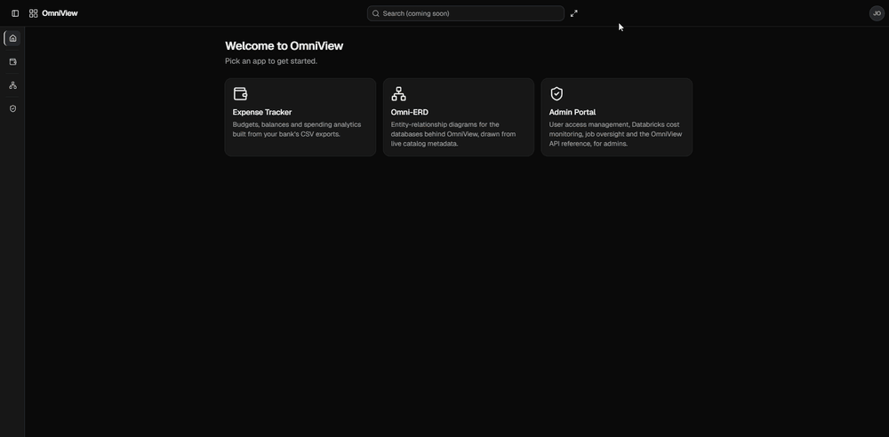

# OmniView

A self-hosted, multi-app analytics dashboard: one shell and one container
serving three apps — a personal-finance warehouse, a live database ERD viewer,
and an admin portal. It runs on Databricks Apps against managed Postgres.

## What it does

**ExpenseTracker** — the app the project grew out of. It parses raw bank CSV
exports, categorizes every transaction against a YAML budget map (a nested
category → subcategory → merchant-match tree), and loads the result through a
medallion dbt project (bronze → silver → gold) into budget-vs-actual tables,
daily balances, and spending trends. Budgets and source files are editable in
the browser, and a Rebuild button re-runs the whole pipeline.

**Omni-ERD** — read-only entity-relationship diagrams drawn from a live database
catalog rather than a checked-in schema file. Because the warehouse is built by
dbt via `CREATE TABLE AS SELECT`, it carries no foreign keys at all, so
relationships are inferred from the surrogate-key naming convention and clearly
marked as guesses rather than presented as fact. Layouts are savable, and the
canvas supports focus mode, search, and multi-select.

**Admin Portal** — per-user, per-app access grants (deny by default), Databricks
cost and job monitoring, and the generated OpenAPI reference.

## How it fits together

A deployment is a single Postgres database with two schemas. `omniview` holds
Django's tables and the source data, and survives pipeline rebuilds; `datavault`
holds everything dbt builds, and is dropped and recreated on every run. One
container serves the Next.js static export and the API same-origin, so there is
no CORS layer and no second service to deploy.

Adding a fourth app means registering one `OmniViewApp` object: that single
registration drives installed apps, API mounting and auth, database routing, and
the access-control list the Admin Portal offers.

## Tech stack

| Layer | Choices |
|---|---|
| **Frontend** | Next.js 16 (App Router, static export), React 19, TypeScript, Tailwind v4, shadcn/ui, React Flow, Tabulator, Recharts |
| **Backend** | Django 6, django-ninja, gunicorn |
| **Data** | PostgreSQL 17, dbt (bronze/silver/gold), pandas, SQLAlchemy |
| **Auth** | Session auth, Microsoft Entra ID SSO, Databricks OAuth in the cloud |
| **Infra** | Databricks Apps + Lakebase in production, Docker Compose locally |
| **Testing** | pytest, Vitest, Playwright, and dbt's own data tests |

That comes to roughly 28,000 lines across the web layer, the pipeline, and the
docs, covered by 326 backend tests, 246 frontend tests, and 9 end-to-end specs.

## Documentation

Every source folder carries a README in one standard format, and a test fails
the build if a new folder arrives without one. The design decisions, the
deployment runbook, and the failure modes I hit along the way are written up in
[`docs/`](docs/) — [`ARCHITECTURE.md`](docs/ARCHITECTURE.md) for the structure
contract and [`DEPLOYMENT.md`](docs/DEPLOYMENT.md) for the Databricks runbook.

The financial data this runs on is private, so it is not in this repository.
[`docs/examples/`](docs/examples/) holds a synthetic stand-in that documents the
input format exactly.

---

Built proudly with [Claude Code](https://claude.com/claude-code).
